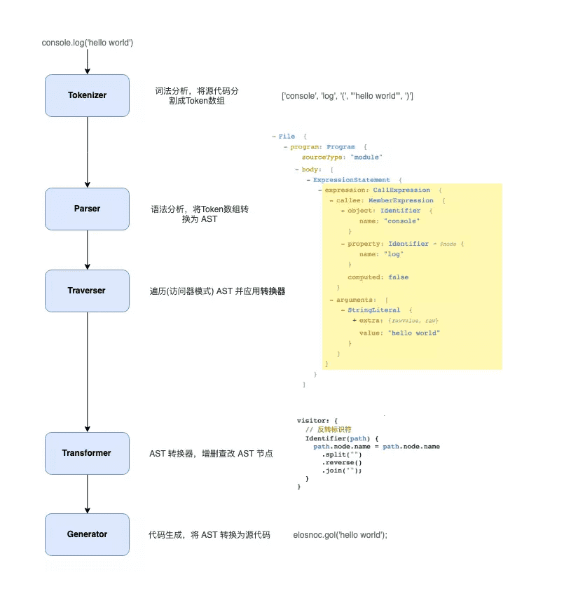
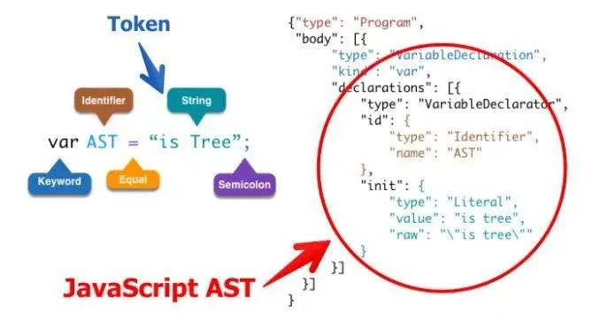
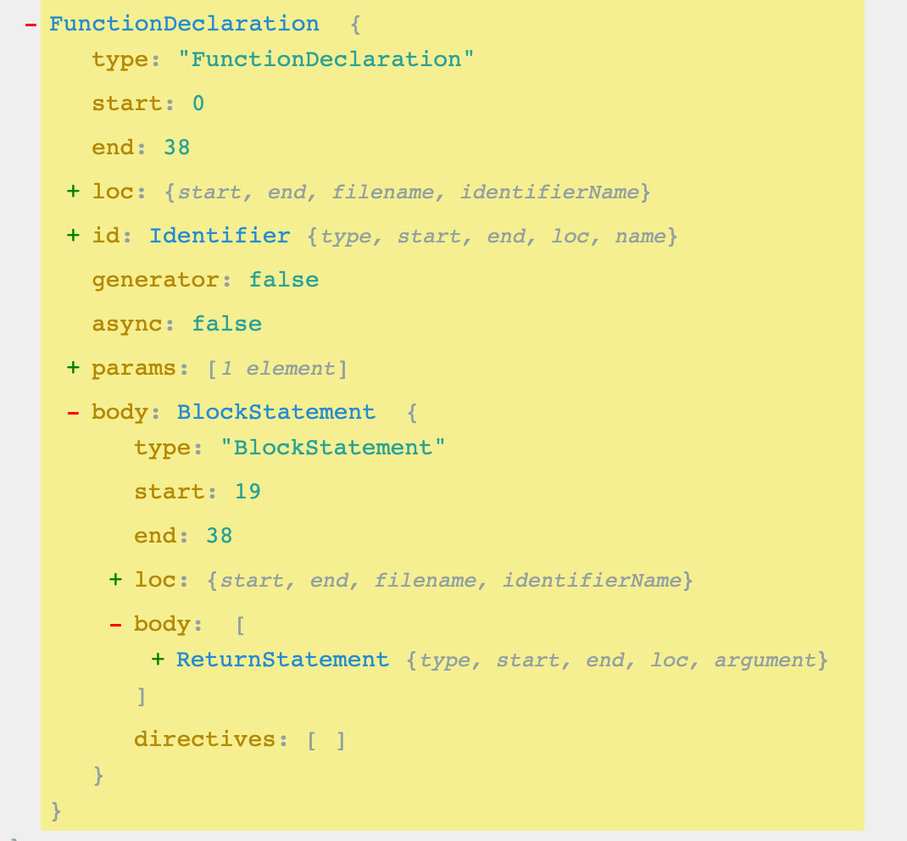
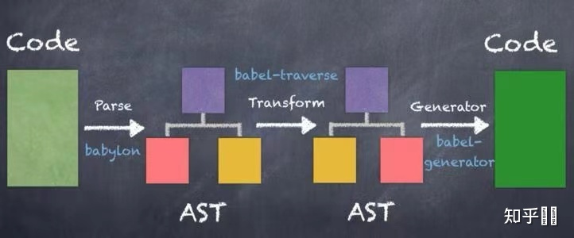

# Babel和Babel工具介绍

## Babel 是一个 JavaScript 编译器

**Babel** 是 JavaScript 编译器 compiler，更确切地说是源码到源码的编译器，通常也叫做 转换编译器（transpiler）。 意思是说你为 Babel 提供一些 JavaScript 代码，Babel 更改这些代码，然后返回给你新生成的代码。

> Babel 是一个通用的多功能的 JavaScript 编译器。此外它还拥有众多模块可用于不同形式的静态分析。
> 静态分析是在不需要执行代码的前提下对代码进行分析的处理过程 （执行代码的同时进行代码分析即是动态分析）。 静态分析的目的是多种多样的， 它可用于语法检查，编译，代码高亮，代码转换，优化，压缩等等场景。

## Babel解析（Parse）

**解析（Parse ）** 步骤接收代码并输出 抽象语法树（AST）。 这个步骤分为两个阶段：词法分析（Lexical Analysis） 和 语法分析（Syntactic Analysis）。



### AST

抽象语法树(Abstract Syntax Tree)简称 AST，是源代码的抽象语法结构的树状表现形式。webpack、eslint 等很多工具库的核心都是通过抽象语法树这个概念来实现对代码的检查、分析等操作。今天我为大家分享一下 JavaScript 这类解释型语言的抽象语法树的概念

我们常用的浏览器就是通过将 js 代码转化为抽象语法树来进行下一步的分析等其他操作。所以将 js 转化为抽象语法树更利于程序的分析。



如上图中变量声明语句，转换为 AST 之后就是右图中显示的样式

左图中对应的：

- var 是一个关键字
- AST 是一个定义者
- = 是 Equal 等号的叫法有很多形式，在后面我们还会看到
- is tree 是一个字符串
- ; 就是 Semicoion
首先一段代码转换成的抽象语法树是一个对象，该对象会有一个顶级的 type 属性 Program；第二个属性是 body 是一个数组。

body 数组中存放的每一项都是一个对象，里面包含了所有的对于该语句的描述信息

```code
type:         描述该语句的类型  --> 变量声明的语句
kind:         变量声明的关键字  --> var
declaration:  声明内容的数组，里面每一项也是一个对象
            type: 描述该语句的类型
            id:   描述变量名称的对象
                type: 定义
                name: 变量的名字
            init: 初始化变量值的对象
                type:   类型
                value:  值 "is tree" 不带引号
                row:    "\"is tree"\" 带引号
```

### 词法分析

词法分析阶段把字符串形式的代码转换为 **令牌（tokens）** 流。

你可以把令牌看作是一个扁平的语法片段数组：

```js
n * n;
```

代码转换成AST后，整体如下

```js
[
  { type: { ... }, value: "n", start: 0, end: 1, loc: { ... } },
  { type: { ... }, value: "*", start: 2, end: 3, loc: { ... } },
  { type: { ... }, value: "n", start: 4, end: 5, loc: { ... } },
  ...
]
```

每一个 type 有一组属性来描述该令牌：

```js
{
  type: {
    label: 'name',
    keyword: undefined,
    beforeExpr: false,
    startsExpr: true,
    rightAssociative: false,
    isLoop: false,
    isAssign: false,
    prefix: false,
    postfix: false,
    binop: null,
    updateContext: null
  },
  ...
}
```

和 AST 节点一样它们也有 start，end，loc 属性。

### 语法分析

语法分析阶段会把一个令牌流转换成 抽象语法树（AST） 的形式。 这个阶段会使用令牌中的信息把它们转换成一个 AST 的表述结构，这样更易于后续的操作。

这个处理过程中的每一步都涉及到创建或是操作抽象语法树，亦称 AST。

> Babel 使用一个基于 ESTree 并修改过的 AST，它的内核说明文档可以在这里. com/babel/babel/blob/master/doc/ast/spec.md)找到。


```js
function square(n) {
  return n * n;
}
```



这个程序可以被表示成如下所示的 JavaScript Object（对象）：

```js
{
  type: "FunctionDeclaration",
  id: {
    type: "Identifier",
    name: "square"
  },
  params: [{
    type: "Identifier",
    name: "n"
  }],
  body: {
    type: "BlockStatement",
    body: [{
      type: "ReturnStatement",
      argument: {
        type: "BinaryExpression",
        operator: "*",
        left: {
          type: "Identifier",
          name: "n"
        },
        right: {
          type: "Identifier",
          name: "n"
        }
      }
    }]
  }
}
```

你会留意到 AST 的每一层都拥有相同的结构：

```js
{
  type: "FunctionDeclaration",
  id: {...},
  params: [...],
  body: {...}
}

{
  type: "Identifier",
  name: ...
}

{
  type: "BinaryExpression",
  operator: ...,
  left: {...},
  right: {...}
}
```

> 注意：出于简化的目的移除了某些属性

这样的每一层结构也被叫做 节点（Node）。 一个 AST 可以由单一的节点或是成百上千个节点构成。 它们组合在一起可以描述用于静态分析的程序语法。

每一个节点都有如下所示的接口（Interface）：

```js
interface Node {
  type: string;
}
```

字符串形式的 type 字段表示节点的类型（如： "FunctionDeclaration"，"Identifier"，或 "BinaryExpression"）。 每一种类型的节点定义了一些附加属性用来进一步描述该节点类型。

Babel 还为每个节点额外生成了一些属性，用于描述该节点在原始代码中的位置。

```js
{
  type: ...,
  start: 0,
  end: 38,
  loc: {
    start: {
      line: 1,
      column: 0
    },
    end: {
      line: 3,
      column: 1
    }
  },
  ...
}
```

每一个节点都会有 start，end，loc 这几个属性。

## Babel核心插件

### @babel/core

babel编译器。被拆分三个模块：@babel/parser、@babel/traverse、@babel/generator。

@babel/parser: 接受源码，进行词法分析、语法分析，生成AST。

@babel/traverse：接受一个AST，并对其遍历，根据preset、plugin进行逻辑处理，进行替换、删除、添加节点。

@babel/generator：接受最终生成的AST，并将其转换为代码字符串，同时此过程也可以创建source map。

@babel/code-frame：生成错误源码以及错误的位置信息，babel/core babel/parser babel/traverse babel/generater等包都使用了这个包，console出错误信息，提示用户

@babel/types：Babel Types模块是一个用于 AST 节点的 Lodash 式工具库（译注：Lodash 是一个 JavaScript 函数工具库，提供了基于函数式编程风格的众多工具函数）， 它包含了构造、验证以及变换 AST 节点的方法。 该工具库包含考虑周到的工具方法，对编写处理AST逻辑非常有用。[文档](https://babeljs.io/docs/en/babel-types)

@babel/template：使用@babel/type创建一些简单节点会很容易，但是如果是大段代码的话就会变得困难了，这个时候我们可以使用@babel/template。

babel转码流程：input string -> @babel/parser parser -> AST -> transformer[s] -> AST -> @babel/generator -> output string。



如果你想很好的了解AST，可以去该网站体验。[AST Explorer](https://astexplorer.net/)

### @babel/cli

终端cli工具。

### @babel/plugin-*

babel插件机制、方便扩展、集成。

### @babel/preset-env

预设：预先设定一组插件，方便我们对插件集成配置管理。当前也可以自定义其他预设@babel/babel-preset-*。

### @babel/polyfill

它是被用来处理上述说的API部分的：为浏览器不支持的API提供对应的兼容性代码，很明显如果你不提供，如果在不支持的浏览器里面使用了新API，那么你的页面就会挂掉。

@babel-polyfill会带来的一些问题。

1、代码体积大(因为会全部导入，不管你用不用的上)， 全部引入的配置如下。

```js
{
  "presets": [ // 另外还需要注意presets的加载顺序是倒叙的。
    [
      "@babel/preset-env",
      {
        "useBuiltIns": "entry", // 这里是关键
        "corejs": "core-js@3" // 使用@babel/polyfill做垫片时候我们需要使用哪个版本的corejs
      }
    ]
  ]
}
```

然后你需要在你的项目入口文件中顶部import '@babel/polyfill'。

改善方式：按需加载。

```js
{
  "presets": [
    "@babel/env",
    {
      "targets":
      {
        "edge": "17",
        "firefox": "60",
        "chrome": "67",
        "safari": "11.1"
      },
      "useBuiltIns": "usage"
    }
  ]
}
```

这样babel会根据你的目标环境中缺失的功能，只把必须的polyfill加载进来。

2、会造成全局污染，比如引入新的全局对象或者修改现有对象原型(尤其对于一些工具或者库的开发者不便)。 比如对于一些静态方法是直接在全局对象添加比如global.Array。 对于一些实例方法是直接在在对象原型上添加，比如Array.prototype.includes。

从babel V7.4.0版本开始，已经不建议使用该包，建议使用core-js/stable、regenerator-runtime/runtime替代。

### @babel/runtime

@babel/runtime是一个底层依赖，是一个生产环境依赖，需要被打包到最终的产物中，它本身会提供的是regenerator-runtime、以及各种helper函数。

我们日常更多的使用到的是@babel/plugin-transform-runtime，这是一个开发环境依赖插件会依赖到@babel/runtime、@babel/runtime-corejs3等。

关于@babel/plugin-transform-runtime我们需要知道两点

1、babel在转码syntax过程中，会加入自己定义的很多babel函数，这些babel函数可能会在每个文件都被重复引用，transform-runtime会把这些重复的helper函数转换成公共的、单独的依赖，节省转码后的文件体积。

2、解决上述中@babel/polyfill会带来的一些问题，transform-runtime以沙盒的方式讲新特性API对应的全局变量转换为core-js、regenerator-runtime的引用。

### .babelrc | babel.config.js | babel.config.json

babel配置文件。

> 插件在 Presets （预设）前运行。  
> 插件顺序从前往后排列。  
> Preset（预设） 顺序是颠倒的（从后往前）。  

### @babel/register

这个模块有时我们写node有些童鞋会使用。通过 require 钩子（hook）将自身绑定到 node 的require模块上，并在运行时进行即时编译。

```js
require("@babel/register");
```

node 后续运行时所需要 require 进来的扩展名为.es6、.es、.jsx、.mjs和.js的文件将由 Babel 自动转换。

## 使用python解析AST

```js
import js2py

esprima = js2py.require('esprima')
escodegen = js2py.require('escodegen')

print(esprima)
```

## 参考文档

[Babel 用户手册](https://github.com/jamiebuilds/babel-handbook/blob/master/translations/zh-Hans/user-handbook.md)  

[Babel 插件手册](https://github.com/jamiebuilds/babel-handbook/blob/master/translations/zh-Hans/plugin-handbook.md)

[AST explorer](https://astexplorer.net/)

[实现一个删除console的babel插件](https://zhuanlan.zhihu.com/p/371711270)

[官方文档](https://www.babeljs.cn/docs/)